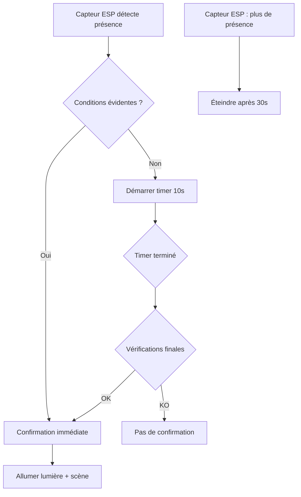

# 🏠 Système de Gestion Automatique des Lumières

## 📖 Vue d'ensemble

Ce système gère automatiquement l'éclairage de votre maison en fonction de votre présence détectée par des capteurs ESP. Il inclut une logique avancée anti-faux-positifs pour éviter les allumages/extinctions intempestifs.

## 🔧 Architecture du Système

### **Composants principaux :**

1. **Script contextuel** : `appliquer_scene_lumiere_contextuelle`
2. **Sensor de présence global** : `sensor.presence_piece` (template)
3. **Helpers de confirmation** : `input_boolean.{piece}_presence_confirmee`
4. **Timers de validation** : `timer.{piece}_confirmation`
5. **Automatisations intelligentes** par pièce

## 🚀 Fonctionnement

### **Flux de détection de présence :**



### **Logique anti-faux-positifs :**

#### **🛏️ Chambre :**
- **Confirmation immédiate** si :
  - `sensor.presence_piece` déjà à "Chambre"
  - Pas d'autres capteurs actifs ET venez d'une pièce adjacente
  - Présence confirmée récemment (< 5min)

#### **🚿 Salle de Bain :**
- **Conditions strictes** (toutes requises) :
  - Fenêtre fermée (`binary_sensor.ouvfenetsdb_contact` = off)
  - Machine à laver éteinte (`sensor.prismal_power` < 5W)
  - Volet stable (open/closed, pas en mouvement)

## 📁 Structure des Fichiers

```
config/
├── configuration.yaml          # timer: !include timers.yaml
├── input_boolean.yaml         # Helpers de confirmation
├── timers.yaml               # Timers de validation
└── automations/
    └── automatisation_lumieres.yaml
```

## ⚙️ Configuration Requise

### **1. Helpers (input_boolean.yaml) :**
```yaml
chambre_presence_confirmee:
  name: "Chambre - Présence Confirmée"
  icon: mdi:motion-sensor

sdb_presence_confirmee:
  name: "SdB - Présence Confirmée"  
  icon: mdi:motion-sensor
```

### **2. Timers (timers.yaml) :**
```yaml
chambre_confirmation:
  duration: "00:00:10"
  name: "Délai confirmation présence chambre"

sdb_confirmation:
  duration: "00:00:10"
  name: "Délai confirmation présence SdB"
```

### **3. Configuration.yaml :**
```yaml
timer: !include timers.yaml
```

## 🎯 Automatisations Incluses

### **A. Gestion de la Présence :**
- `Chambre - Analyse Présence`
- `SdB - Analyse Présence`

### **B. Contrôle des Lumières :**
- `Chambre - Gestion Lumière Confirmée`
- `SdB - Gestion Lumière Confirmée`
- `Lumières - Allumages Manuels` (toutes pièces)
- `Entrée - Allumage Salon et Salle à Manger`

## 🎨 Gestion Contextuelle des Scènes

Le script `appliquer_scene_lumiere_contextuelle` applique automatiquement :

| Mode | Conditions | Scène Applied |
|------|------------|---------------|
| **Veilleuse** | Nuit OU force_veilleuse=true | `scene.hue_{piece}_1_veilleuse` |
| **Atténuée** | Jour + (récent changement jour/nuit OU soleil couché) | `scene.hue_{piece}_3_attenue` |
| **Stimulation** | Jour normal | `scene.hue_{piece}_2_stimulation` |

## 🐛 Debug et Monitoring

### **États à surveiller :**
- `input_boolean.chambre_presence_confirmee`
- `input_boolean.sdb_presence_confirmee`
- `timer.chambre_confirmation`
- `timer.sdb_confirmation`

### **Attributs utiles du sensor.presence_piece :**
- `pieces_occupees` : Liste des pièces avec présence détectée
- `nombre_pieces_occupees` : Nombre de pièces occupées
- `sdb_exclue` : Si la SdB est exclue pour faux positif

## ⚡ Points Forts

### **🎯 Réactivité :**
- Allumage immédiat si conditions évidentes
- Pas d'attente inutile

### **🛡️ Fiabilité :**
- Double validation (immédiate + différée)
- Conditions spécifiques par pièce
- Gestion des cas edge

### **🔧 Maintenabilité :**
- Séparation logique claire
- États visibles dans l'interface
- Facile à ajuster/déboguer

## 🔄 Scénarios d'Usage

### **✅ Cas normal - Chambre :**
1. Vous entrez → Capteur détecte → Pas d'autres capteurs actifs
2. **Confirmation immédiate** → Lumière s'allume instantanément
3. Vous sortez → Capteur off pendant 30s → Lumière s'éteint

### **⚠️ Cas faux positif - SdB :**
1. Capteur détecte → Fenêtre ouverte + machine allumée
2. **Timer démarre** (10s) → Vérifications supplémentaires
3. Timer fini → Conditions toujours défavorables → **Pas d'allumage**

### **🌙 Mode nuit :**
- Pas d'allumage automatique en chambre
- Allumage manuel → Veilleuse automatique

## 🔧 Personnalisation

### **Ajuster les durées :**
```yaml
# Plus réactif
chambre_confirmation:
  duration: "00:00:05"

# Plus conservateur pour SdB
sdb_confirmation:
  duration: "00:00:15"
```

### **Ajouter une pièce :**
1. Créer le helper : `input_boolean.nouvelle_piece_presence_confirmee`
2. Créer le timer : `timer.nouvelle_piece_confirmation`  
3. Dupliquer et adapter une automatisation existante

## 📞 Support

En cas de problème :
1. Vérifier les logs Home Assistant
2. Contrôler les états des helpers dans **Outils de développement > États**
3. Tester manuellement les helpers pour isoler le problème
