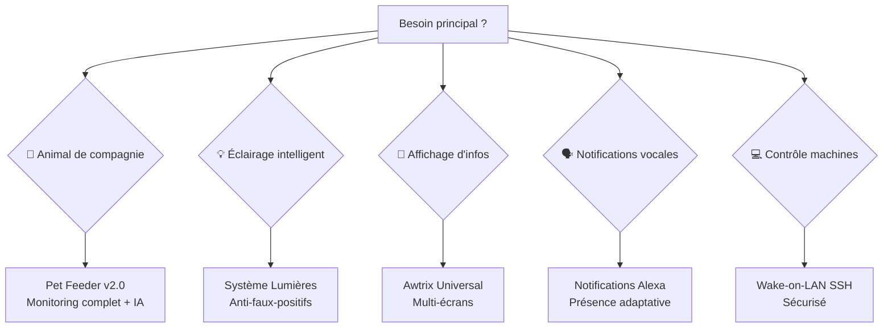

# 🏠 Home Assistant Advanced Projects Collection

Une collection d'intégrations sophistiquées pour Home Assistant, offrant des solutions complètes d'automatisation domestique avec intelligence artificielle intégrée et interfaces utilisateur avancées.

## 🎯 Vue d'ensemble

Cette collection propose **5 projets majeurs** couvrant l'essentiel de la domotique moderne : gestion automatique des lumières, monitoring animal avec IA, notifications vocales adaptatives, affichage dynamique et contrôle distant de machines. Chaque projet est conçu pour être autonome tout en s'intégrant parfaitement dans un écosystème global.

## 📦 Projets disponibles

### 🌟 **Système de Gestion Automatique des Lumières**
*Intelligence contextuelle et logique anti-faux-positifs*

#### ✨ Fonctionnalités avancées
- **🎯 Réactivité intelligente** : Allumage immédiat si conditions évidentes
- **🛡️ Logique anti-faux-positifs** : Double validation (immédiate + différée)
- **🎨 Scènes contextuelles** : Veilleuse/Atténuée/Stimulation selon l'heure
- **🔧 Conditions spécifiques** : Logique personnalisée par pièce
- **📊 États visibles** : Monitoring complet dans l'interface

#### 💡 Cas d'usage
- Allumage automatique en entrant dans une pièce
- Évitement des faux positifs (SdB avec fenêtre/machine)
- Mode nuit avec veilleuses automatiques
- Gestion intelligente des adjacences entre pièces

---

### 🐾 **Pet Feeder v2.0 - Monitoring Animal IA**
*Solution professionnelle avec analytics prédictifs et surveillance santé*

#### 🚀 Nouveautés v2.0
- **🤖 Intelligence artificielle** : Prédictions + détection anomalies + messages contextuels
- **💧 Surveillance hydratation** : Ratio ml/g avec conseils vétérinaires
- **⚖️ Validation croisée** : Balance physique HX711 + estimation logicielle
- **📈 Analytics historiques** : Moyennes 7j/30j avec tendances long terme
- **🗄️ Base MariaDB** : Historique 365j pour analyses prédictives

#### 🔬 Fonctionnalités techniques
- **Double capteur HX711** : Croquettes + eau avec auto-calibration
- **4 méthodes prédiction** : Classique/Précis/IA/Balance physique
- **Rapports automatiques** : Mensuels avec recommandations IA
- **Mode dégradé** : Basculement intelligent si capteur défaillant
- **Alertes graduées** : Info → Critique avec escalade automatique

---

### 📱 **Awtrix Universal Script**
*Affichage dynamique sur écrans matriciels avec détection automatique*

#### 🎨 Capacités créatives
- **🔍 Auto-discovery** : Détection automatique de tous les Awtrix
- **⚡ Dual-mode** : Notifications temporaires OU applications permanentes
- **🌈 Personnalisation totale** : Couleurs, icônes, effets, vitesse, dégradés
- **📡 Diffusion multi-écrans** : Simultanée sur plusieurs appareils
- **🎯 Applications contextuelles** : Température avec codes couleur adaptatifs

#### 💻 Interface intégrée
- Documentation intégrée dans Home Assistant
- Contrôles visuels pour tests en temps réel
- Templates avancés pour contenu dynamique
- Gestion intelligente des erreurs MQTT

---

### 📬 **Notifications Dynamiques Alexa**
*Système vocal intelligent avec gestion contextuelle de la présence*

#### 🧠 Intelligence spatiale
- **🏠 Détection multi-pièces** : Analyse en temps réel des capteurs ESP
- **🎯 Sélection adaptative** : Echo optimal selon présence et priorités
- **🎵 Gestion musicale** : Pause/reprise automatique avec sauvegarde volume
- **🌙 Modes temporels** : Jour/nuit avec conditions personnalisables
- **⚡ Deux versions** : Echo principal OU diffusion simultanée

#### 🔧 Logique avancée
- Exclusion intelligente SdB (conditions fenêtre/prismal)
- Calcul adaptatif durée des messages
- Priorité spatiale configurable (Salon > Cuisine > Chambre)
- Attributs détaillés pour debugging et monitoring

---

### ⚡ **Switch Wake-on-LAN + SSH Shutdown**
*Contrôle sécurisé de machines Linux distantes*

#### 🔐 Sécurité renforcée
- **🔑 Authentification par clés** : SSH sécurisé sans mot de passe
- **💾 Stockage persistant** : Clés dans `/config/.ssh/` (survit aux mises à jour)
- **🛡️ Connexions chiffrées** : Toutes les communications sécurisées
- **⚙️ Configuration modulaire** : YAML séparé ou intégré

#### ⚡ Simplicité d'usage
- Switch unique dans l'interface Home Assistant
- Allumage instantané via Wake-on-LAN
- Extinction propre via SSH shutdown
- Diagnostic intégré et logs détaillés

## 🏗️ Architecture technique globale

### 🎛️ Technologies utilisées
| Technologie | Projets concernés | Usage |
|-------------|------------------|-------|
| **ESPHome** | Lumières, Pet Feeder | Capteurs présence, balances HX711 |
| **MQTT** | Awtrix, Pet Feeder | Communication temps réel |
| **MariaDB** | Pet Feeder v2.0 | Historique long terme 365j |
| **Google AI** | Pet Feeder v2.0 | Génération messages contextuels |
| **Templates avancés** | Tous projets | Logique conditionnelle complexe |
| **SSH/WOL** | Wake-on-LAN | Contrôle machines distantes |

### 🔄 Intégrations natives
- **Zigbee2MQTT** pour appareils Zigbee
- **Alexa Media Player** pour notifications vocales
- **Recorder optimisé** pour performances base de données
- **Cartes personnalisées** : mini-graph-card, bar-card, template-entity-row

## 🚀 Installation rapide

### Prérequis système
```yaml
# Configuration minimale requise
- Home Assistant Core 2024+
- Add-on Terminal & SSH
- Intégration MQTT configurée
- Python 3.11+ (pour templates avancés)
```

### 🎯 Installation par projet

| Projet | Temps d'installation | Complexité | Dépendances |
|--------|---------------------|------------|-------------|
| **Lumières** | 15 min | ⭐⭐ | Capteurs ESP |
| **Pet Feeder v2.0** | 45 min | ⭐⭐⭐⭐ | MariaDB, HX711, Google AI |
| **Awtrix** | 10 min | ⭐ | Appareils Awtrix |
| **Notifications Alexa** | 20 min | ⭐⭐⭐ | Echo, capteurs présence |
| **Wake-on-LAN** | 15 min | ⭐⭐ | Machine Linux cible |

### ⚡ Installation express
```bash
# Cloner la collection
git clone [repository]
cd home-assistant-projects

# Choisir un projet
cd Pet_feeder/  # ou Lumieres/ Awtrix/ etc.

# Suivre le README spécifique
cat README.md
```

## 🎯 Guide de sélection par besoin

### 🏠 Par type de logement
| Type | Projets recommandés | Justification |
|------|-------------------|---------------|
| **Studio/T1** | Awtrix + Wake-on-LAN | Affichage central + contrôle PC |
| **Appartement** | Lumières + Notifications | Automatisation sans capteurs externes |
| **Maison** | Collection complète | Écosystème intégral possible |
| **Maison connectée** | Pet Feeder v2.0 + Lumières | IA avancée + gestion fine |

### 🔧 Par niveau technique
| Niveau | Projets conseillés | Évolution |
|--------|-------------------|-----------|
| **Débutant** | Awtrix → Wake-on-LAN | Interface simple, configuration guidée |
| **Intermédiaire** | Lumières → Notifications | Logique conditionnelle, capteurs |
| **Avancé** | Pet Feeder v2.0 | IA, base de données, analytics |
| **Expert** | Collection complète | Écosystème intégré personnalisé |

### 🎯 Par cas d'usage prioritaire


## ⚡ Fonctionnalités phares par projet

### 🧠 Intelligence artificielle intégrée
```yaml
Pet Feeder v2.0:
  - Prédictions consommation avec correction tendancielle
  - Génération messages contextuels style K-2SO
  - Détection anomalies comportementales adaptatives
  - Recommandations santé personnalisées
```

### 🎯 Logique anti-faux-positifs
```yaml
Système Lumières:
  - Double validation (immédiate + temporisée)
  - Conditions d'évidence par pièce
  - Exclusions intelligentes (SdB fenêtre ouverte)
  - États de confirmation visibles
```

### 🎨 Interface utilisateur avancée
```yaml
Interfaces communes:
  - Dashboards visuels avec graphiques temps réel
  - Contrôles manuels intégrés
  - Indicateurs de santé système
  - Diagnostic et debugging facilités
```

## 📊 Monitoring et observabilité

### 🔍 Métriques par projet
| Projet | Métriques clés | Alertes |
|--------|----------------|---------|
| **Lumières** | Confirmations/Faux-positifs | États helpers |
| **Pet Feeder** | Score global/10, précision prédictive | Multi-niveau |
| **Awtrix** | Taux succès MQTT, appareils actifs | Connectivité |
| **Alexa** | Pièces détectées, Echo sélectionné | Présence |
| **Wake-on-LAN** | État SSH, connectivité réseau | Disponibilité |

### 📈 Analytics et historiques
- **Logs centralisés** avec contexte IA (Pet Feeder)
- **Graphiques évolution** moyennes 7j/30j
- **Détection tendances** automatique avec pourcentages
- **Rapports mensuels** générés automatiquement
- **Diagnostic système** temps réel avec recommendations

## 🛠️ Personnalisation avancée

### 🎨 Configuration modulaire
Chaque projet supporte :
- **Templates Jinja2** pour logique conditionnelle complexe
- **Variables d'environnement** pour adaptation multi-logements
- **Seuils configurables** selon les préférences utilisateur
- **Extensions tierces** via cartes personnalisées

### ⚙️ Intégration écosystème
```yaml
# Exemple d'intégration croisée inspiré des projets
automation:
  - alias: "Arrivée au salon"
    trigger:
      - platform: state
        entity_id: sensor.presence_piece
        to: 'Salon'
    action:
      # Allumage lumières contextuelles
      - service: script.appliquer_scene_lumiere_contextuelle
      # Notification Alexa si conditions OK
      - service: script.notification_alexa
        data:
          message: "Bienvenue au salon"
      # Affichage température sur Awtrix
      - service: script.awtrix_dynamique_customapp
        data:
          message: "Salon 22°C"
          icone: "temp_salon"
          color: "#2e8b57"
```

## 📚 Ressources et support

### 📖 Documentation par projet
Chaque projet dispose de :
- **README détaillé** avec exemples concrets
- **Guide d'installation** étape par étape
- **Section troubleshooting** avec solutions courantes
- **Exemples d'usage** pour inspiration

### 🤝 Communauté et contributions
- **Issues tracking** pour rapports de bugs
- **Feature requests** pour nouvelles fonctionnalités
- **Pull requests** pour contributions communautaires
- **Wiki partagé** avec configurations utilisateurs

### 🔧 Support technique
```markdown
En cas de problème :
1. Consulter le README du projet concerné
2. Vérifier les logs Home Assistant
3. Tester les entités dans Developer Tools
4. Consulter la section troubleshooting
5. Ouvrir une issue si problème persistant
```


## 🎉 Conclusion

Cette collection combine simplicité d'usage et sophistication technique. Chaque projet peut être utilisé indépendamment ou intégré dans un écosystème plus large selon vos besoins.

### ✨ Points forts de la collection
- **🤖 Intelligence artificielle** intégrée (Pet Feeder v2.0)
- **🎯 Logiques anti-faux-positifs** avancées (Lumières)
- **🎨 Interfaces utilisateur** avec dashboards dédiés
- **🔧 Modularité** permettant adaptation selon vos besoins
- **📊 Monitoring** intégré pour debugging facilité

**Commencez par le projet qui répond à votre besoin immédiat, puis étendez selon vos envies.**

*Explorez chaque dossier pour accéder aux documentations complètes et aux fichiers de configuration.*
